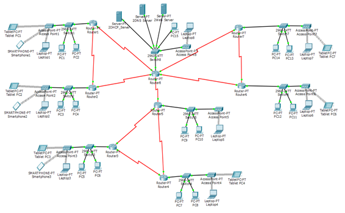

# Design and Implementation of Apex University Campus Network

## 📌 Project Overview

This project presents the design and implementation of a campus network for **Apex University** using **Cisco Packet Tracer**. The network is designed to provide reliable communication between different departments while ensuring scalability, efficient routing, and proper network segmentation.

---

## 🎯 Objectives

- Design a complete university campus network.
- Connect multiple departments using routers and switches.
- Configure IP addressing and subnetting.
- Enable communication between all network devices.
- Simulate the network using Cisco Packet Tracer.

---

## 🛠️ Software Used

- Cisco Packet Tracer

---

## 📂 Repository Contents

| File | Description |
|------|-------------|
| 📄 Report.pdf | Complete project report |
| 📦 Campus_Network.pkt | Cisco Packet Tracer project file |

---

## 🏫 Network Features

- Multiple departments connected
- Routers and switches
- IP addressing and subnetting
- End-to-end connectivity
- Network simulation using Cisco Packet Tracer

---

## 🚀 How to Run

1. Install Cisco Packet Tracer.
2. Open the `.pkt` file.
3. Run the simulation.
4. Test connectivity using ping between devices.

---

## 📚 Course Information

**Course Code:** CSE405

**Course Title:** Computer Networks

---

## 👩‍💻 Author

**Samiha Hasan**

Department of Computer Science and Engineering

---

## 📜 License

This project is shared for educational and learning purposes.
